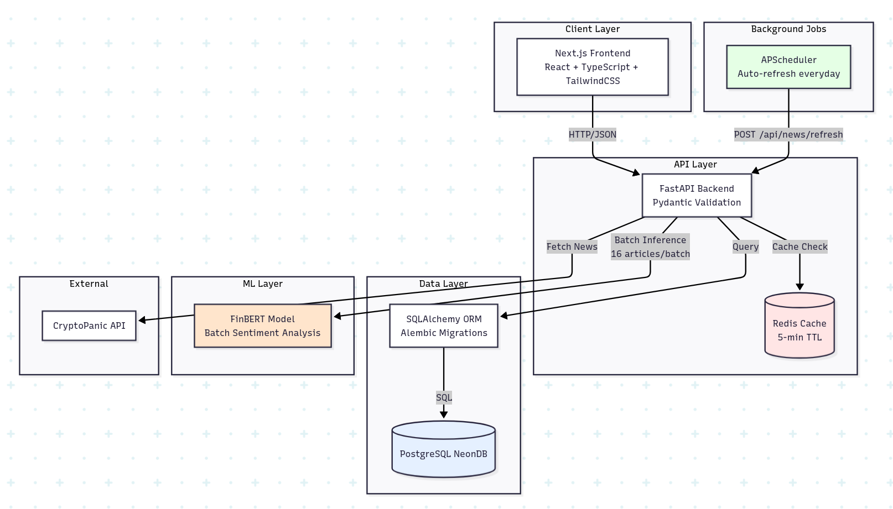
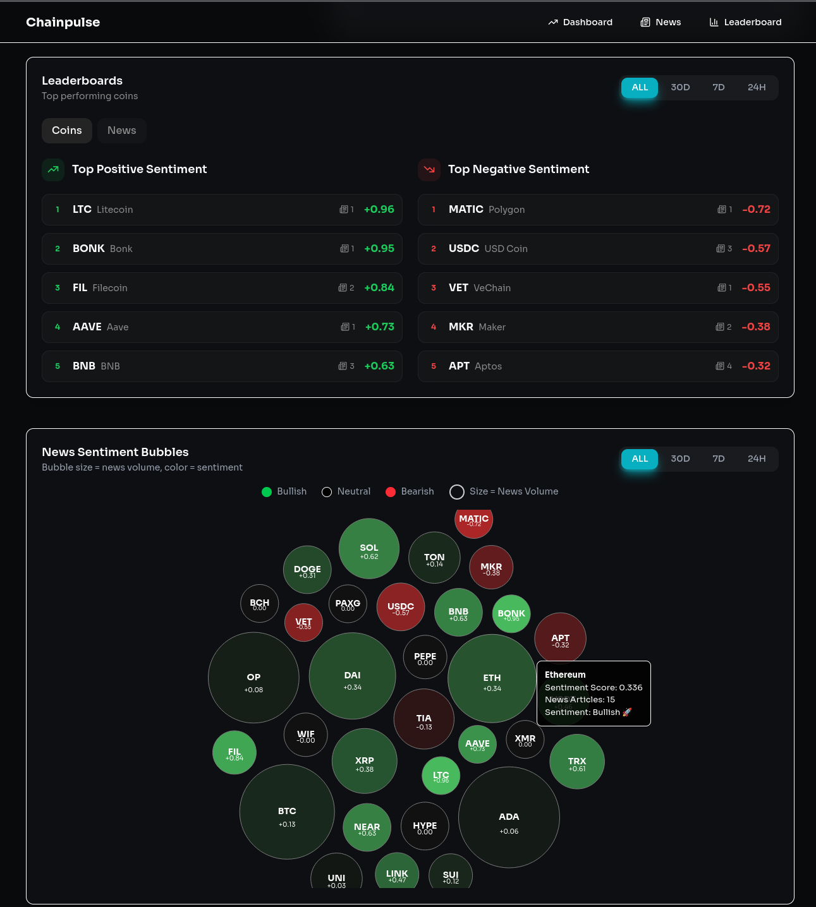
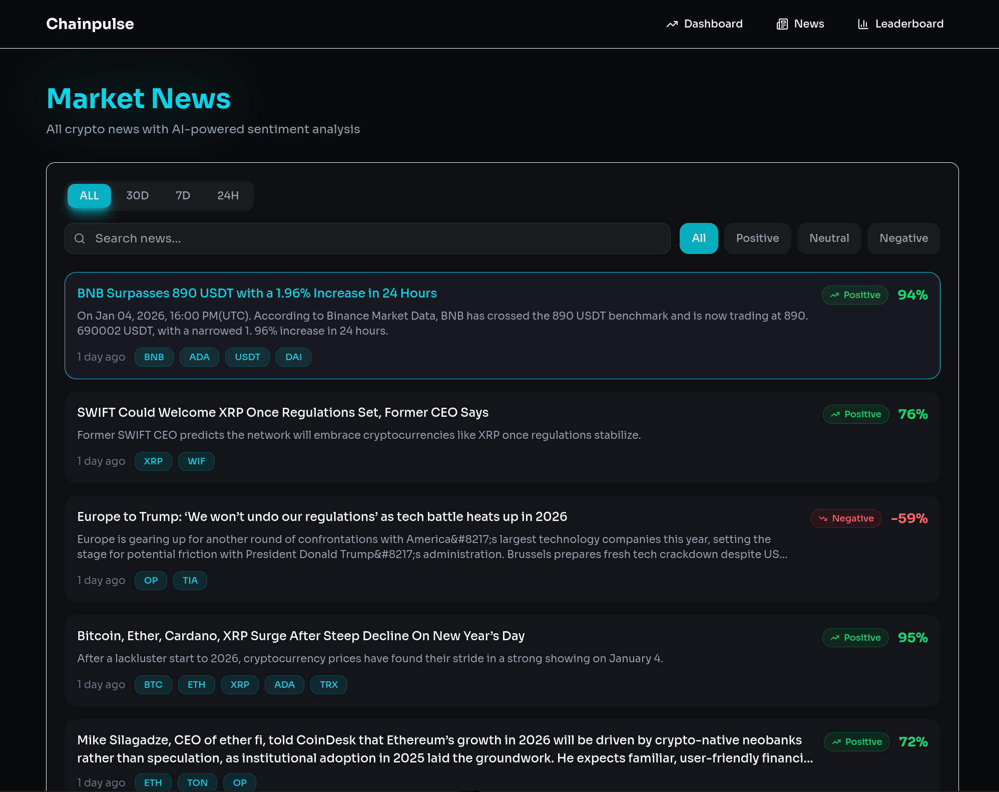

# ChainPulse

> Cryptocurrency sentiment analysis dashboard powered by AI

ChainPulse aggregates crypto news, analyzes sentiment using FinBERT, and delivers actionable market insights through interactive visualizations. This platform is made for people that want to read the market fast.

> `Click the button below for the LIVE DEMO`

[](https://chainpulse-ai.vercel.app)
[](https://opensource.org/licenses/MIT)

---

## ✨ Features

- **AI-Powered Sentiment Analysis** - FinBERT analyzes 100+ daily crypto articles with 85%+ accuracy
- **Market Sentiment Tracking** - Aggregated scores across 24h, 7d, 30d time periods
- **Interactive Visualizations** - D3.js bubble charts showing sentiment across 60+ coins
- **Smart Coin Matching** - Automatic extraction and tagging of mentioned cryptocurrencies
- **Performance Optimized** - Redis caching + batch processing for sub-400ms responses
- **Duplicate Prevention** - Intelligent deduplication ensures clean news feed

---

## Tech Stack & Tools Used


---

## System Design

### Architecture Diagram



### Key Design Decisions and Assumptions

**1. Batch Processing for ML Inference**

- Processes 16 articles simultaneously instead of sequential analysis
- Reduces sentiment analysis time from 3 minutes to 15-20 seconds (~10x faster)

**2. Caching Strategy**

- 5-minute Redis TTL balances freshness with performance
- Query-level caching for news, sentiment, and coin aggregations
- TanStack Query for optimistic frontend updates

**3. Database Optimization**

- Indexed `published_at` and `sentiment_label` for fast filtering
- Eager loading (`joinedload`) eliminates N+1 query problem
- Unique constraint on `(title, published_at)` prevents duplicates

**4. Startup Model Preloading**

- BERT model loads during app startup (not first request)
- Singleton pattern prevents redundant model instances

### Performance Optimizations

| Optimization              | Before   | After | Impact      |
| ------------------------- | -------- | ----- | ----------- |
| **Batch BERT Processing** | 180s     | 20s   | 9x faster   |
| **Database Indexes**      | 2000ms   | 300ms | 6.7x faster |
| **N+1 Query Fix**         | 1500ms   | 150ms | 10x faster  |
| **Redis Caching**         | DB query | <50ms | 30x faster  |

---

## Screenshots

### Dashboard Overview


> \_Sentiment gauge, market trends

### Leaderboard and Interactive Bubble Chart



> _D3.js visualization showing sentiment distribution across 60+ cryptocurrencies_

### News Feed with Sentiment & Their Related Coins



> _AI-analyzed crypto news with sentiment scores and coin tags_

---

## Quick Start

### Prerequisites

- Node.js 18+
- Python 3.11+
- PostgreSQL 14+
- Redis (or Upstash account)

### Backend Setup

```bash
cd backend
python -m venv venv
source venv/bin/activate  # Windows: venv\Scripts\activate
pip install -r requirements.txt

# Configure environment
cp .env.example .env
# Edit .env with your credentials

# Run migrations
alembic upgrade head

# Start server
uvicorn app.main:app --reload
```

### Frontend Setup

```bash
cd frontend
npm install

# Configure environment
cp .env.local.example .env.local
# Edit .env.local with API URL

# Start development server
npm run dev
```

Visit `http://localhost:3000`

---

## 📚 API Documentation

### Endpoints

**News**

- `GET /api/news` - Paginated news with filters (period, sentiment, search)
- `POST /api/news/refresh` - Fetch latest news from CryptoPanic

**Sentiment**

- `GET /api/sentiment/aggregate` - Overall market sentiment by period
- `GET /api/coins/sentiment` - Top 5 bullish/bearish coins
- `GET /api/coins/bubble` - All coins data for bubble chart

Interactive API docs available at `/docs` when running locally.

---

## 🥽 Technology Deep Dive

### Natural Language Processing (NLP)

- **FinBERT**: Financial domain-specific BERT model fine-tuned on financial news
- **Batch Inference**: Processes multiple texts simultaneously for 10x speedup
- **Normalization**: Scores mapped to -1 (bearish) to +1 (bullish) scale

### Coin Matching Algorithm

- **Aho-Corasick**: Multi-pattern matching for efficient coin symbol detection
- **Levenshtein Distance**: Fuzzy matching for misspellings and variations
- **Coverage**: 70+ major and most popular cryptocurrencies (BTC, ETH, SOL, etc.)

### Data Pipeline

1. **Ingestion**: CryptoPanic API provides 20-30 articles per fetch
2. **Analysis**: FinBERT batch processing (16 articles/batch)
3. **Extraction**: Coin matcher identifies mentioned cryptocurrencies
4. **Storage**: PostgreSQL with deduplication and indexing
5. **Caching**: Redis stores aggregated results (5-min TTL)

---

## Acknowledgments & References

- [ProsusAI/finbert](https://huggingface.co/ProsusAI/finbert) - Financial sentiment analysis model
- [CryptoPanic](https://cryptopanic.com) - Crypto news aggregation API
- [Railway](https://railway.com/) - Backend deployment
- [Vercel](https://vercel.com) - Frontend deployment

---

**Made by [Andrew Tedjapratama](https://github.com/andrewtedja)**
